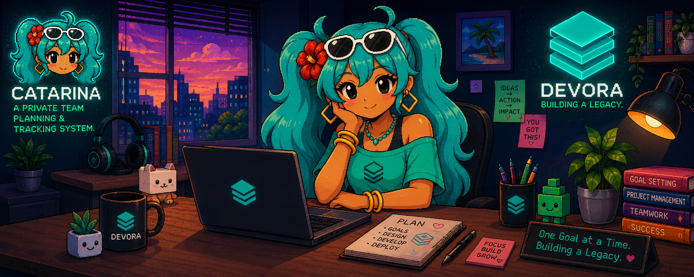

<div align="center">
  
</div>
<br />
<div>
    <a href="https://catarina-devora.vercel.app"></a>
    
    
    
    
    
  </p>
</div>

---

##  What is Catarina?

**Catarina** is a private, multi-section team planning and progress tracking application built for agile design, engineering, marketing, and management teams. Each department gets its own dedicated workspace equipped with goal boards, interactive progress counters, sub-item checklists, and inline team discussions. 

Administrators have global visibility across all sections, while members work within their assigned department spaces. Catarina features real-time synchronization, month-by-month planning cycles with multi-page PDF exports, custom profile avatars, audio-enabled notifications, and installable PWA capabilities.

<br />

<div align="center">
  
</div>

---

##  Deploy Your Own Catarina

Follow this step-by-step guide to deploy your own instance of Catarina on local development hardware or hosting platforms like Vercel with a Turso cloud database.

### Prerequisites

Before starting, ensure you have the following tools and accounts:

- **Node.js**: v20.0.0 or higher
- **Package Manager**: `npm` (comes with Node.js)
- **Database**: A free account on [Turso](https://turso.tech) (libSQL / distributed SQLite edge database)
- **Deployment Platform** *(Optional)*: A free account on [Vercel](https://vercel.com)

---

### Step 1: Clone & Install

Clone the repository to your local machine and install all dependencies:

```bash
git clone https://github.com/Omar-Khaled-57/Catarina.git
cd Catarina
npm install
```

---

### Step 2: Provision a Turso Database

1. Install the Turso CLI:
   - **macOS / Linux**: `curl -sSfL https://get.tur.so/install.sh | bash`
   - **Windows (PowerShell)**: `winget install tursodatabase.turso`
2. Authenticate with Turso:
   ```bash
   turso auth login
   ```
3. Create a new Turso database named `catarina`:
   ```bash
   turso db create catarina
   ```
4. Retrieve your database URL and generate an authentication token:
   ```bash
   # Show database URL (e.g., libsql://catarina-youruser.turso.io)
   turso db show catarina --url

   # Create a persistent authentication token
   turso db tokens create catarina
   ```

---

### Step 3: Configure Environment Variables

Create a `.env` file in the root directory of your project (you can copy `.env.example`):

```env
# Team Branding (White-Labeling)
NEXT_PUBLIC_TEAM_NAME="Devora"

# Turso Cloud Database Credentials
DATABASE_URL="libsql://catarina-youruser.turso.io"
TURSO_AUTH_TOKEN="your_turso_auth_token_here"

# Authentication Security
JWT_SECRET="your_custom_secure_random_string_here"
```

#### Environment Variable Breakdown:

| Variable | Description | Example |
|---|---|---|
| `NEXT_PUBLIC_TEAM_NAME` | The brand name shown across navigation, footers, page titles, and PDF report exports | `"Devora"` or `"Acme Corp"` |
| `DATABASE_URL` | Your Turso database `libsql://` connection string | `"libsql://catarina-user.turso.io"` |
| `TURSO_AUTH_TOKEN` | Authentication token created via `turso db tokens create` | `"eyJhbG...` |
| `JWT_SECRET` | Secret key used for signing session JWT tokens | `"super-secret-key-123"` |

---

### Step 4: Push Schema & Seed Initial Data

Push the database schema to your remote Turso database and run the seeder script to initialize default sections, admin credentials, and sample goals:

```bash
# Push SQL schema directly to Turso cloud
npx prisma db push --env-file=.env

# Seed initial sections, admin account, and sample data
npm run db:seed
```

> **Note:** The seeder creates 4 default department sections (**Marketing**, **Art**, **Technical**, **Management**), creates default planning months (**July 2026** active, **June 2026** archived), and sets up the default admin login.

---

### Step 5: Run Locally & Verify Setup

Start the local Next.js development server:

```bash
npm run dev
```

Open your browser and navigate to [http://localhost:3000](http://localhost:3000).

Sign in using the **Default Admin Credentials**:

| Role | Email | Password |
|---|---|---|
| **Admin** | `admin@team.com` | `admin123` |

>  **Important Security Action:** After logging in for the first time, click your profile picture in the navbar to change your email, password, and upload your custom profile photo!

---

### Step 6: Deploy to Vercel (Production)

Deploying Catarina to production on Vercel takes less than 2 minutes:

1. Push your repository to GitHub, GitLab, or Bitbucket.
2. Log in to [Vercel](https://vercel.com) and click **Add New Project**.
3. Import your Catarina repository.
4. In the **Environment Variables** section, add the 4 environment variables configured in Step 3:
   - `NEXT_PUBLIC_TEAM_NAME`
   - `DATABASE_URL`
   - `TURSO_AUTH_TOKEN`
   - `JWT_SECRET`
5. Click **Deploy**. Vercel will build and publish your app with full PWA and real-time sync support.

---

### Step 7: White-Labeling & Team Customization

You can fully customize Catarina for your own team:

- **Team Name**: Change `NEXT_PUBLIC_TEAM_NAME` in `.env` (or Vercel settings) to automatically rebrand all headers, footers, page titles, and exported PDF reports.
- **Section Management**: Navigate to **Admin Panel > Section Manager** to add new department sections, customize color themes, edit prefixes, or reorder cards.
- **Member Management**: Approve new user signups, assign members to multiple sections, or reset passwords directly from the Admin Panel.

---

##  Default Credentials

| Role | Email | Password | Assigned Sections |
|---|---|---|---|
| **Admin** | `admin@team.com` | `admin123` | All Sections (Global Access) |
| **Marketing Member** | `marketing@devora.com` | `member123` | Marketing |
| **Art Member** | `art@devora.com` | `member123` | Art, Marketing |
| **Technical Member** | `technical@devora.com` | `member123` | Technical |
| **Management Member** | `management@devora.com` | `member123` | Management |

---

##  Profile Customization

Every user can customize their personal profile from the Navbar modal:

- **Display Name** — Your public team display name
- **Email Address** — Account login email
- **Password Update** — Self-service password change (requires current password validation)
- **Profile Photo** — Upload custom avatars (JPG, PNG, GIF, WebP — max 2 MB)
- **Bio** — Personal role bio displayed in user cards

### Default Section Profile Avatars

When a user has not uploaded a custom avatar, section-themed default avatars are assigned automatically:

| Section | Default PFP | Asset Path |
|---|---|---|
| **Marketing** | Initial Fallback | Colored text initial avatar |
| **Art** | Art Mascot | `public/pfps/art.png` |
| **Technical** | Tech Animated GIF | `public/pfps/tec.gif` |
| **Management** | Manager Animated GIF | `public/pfps/mng.gif` |

---

##  Core Features

### ✦ Real-Time Collaboration & Sync
Changes made by team members (goal updates, step completions, new comments) sync automatically across active clients within 5 seconds without requiring page reloads. Includes optimistic UI updates, background delta fetching, and subtle shimmer animations on incoming changes.

### ✦ Multi-Section Goal Boards
Dynamic, customizable department sections (Marketing, Art, Technical, Management, or custom admin-created sections). Goals support target counters (`current / target`), deadlines, lockable admin controls, member assignments, and drag-free step checklists.

### ✦ Monthly Planning & Archiving
Organize goal progress into monthly cycles. Past months can be archived and browsed anytime. Generate multi-page, dark-themed PDF reports complete with overview donut metrics, goal breakdown tables, and section completion bar charts.

### ✦ Interactive Performance Dashboard
Live telemetry showing total goals, completed count, remaining tasks, and global completion percentage with animated counter transitions and responsive section status cards.

### ✦ Audio-Enabled Notification Center
In-app notification drawer with category tagging, pinning, read management, and inline audio playback support (includes pinned "Why Catarina? 🌸" audio message).

### ✦ Installable Progressive Web App (PWA)
Built with an offline-capable Service Worker (v3) and Web Manifest — installable natively on iOS, Android, macOS, and Windows desktop devices.

---

##  Catarina Expression Stickers

Catarina features 13 context-aware pixel art expression stickers throughout the user interface:

| Sticker | Asset Path | In-App Context & Expression |
|---|---|---|
|  | `public/rina/logo.webp` | Header logo, brand emblem, and application favicon |
|  | `public/rina/happy.webp` | Welcome notifications, positive status alerts, success states |
|  | `public/rina/wave.webp` | General intro sections, welcome messages |
|  | `public/rina/thumb.webp` | Deployment section headers, admin approval approvals |
|  | `public/rina/excited.webp` | Goal completion popups, member joined notifications |
|  | `public/rina/celebration.webp` | First-time welcome celebration modal, month completion modal |
|  | `public/rina/bug-fix.webp` | Patch releases, bug fix notifications |
|  | `public/rina/update.webp` | Realtime sync notifications, feature updates |
|  | `public/rina/think.webp` | Empty goal state illustrations, search empty states |
|  | `public/rina/sleeping.webp` | Empty notification panel state, footer mascot |
|  | `public/rina/cry.webp` | Rejected sign-up requests, user left section alerts |
|  | `public/rina/bye.webp` | Account deletion modals, sign-out prompts |
|  | `public/rina/404.webp` | Custom 404 page illustration |

---

##  Tech Stack

| Layer | Technology | Version | Purpose |
|---|---|---|---|
| **Framework** | Next.js (App Router) | `16.2` | Full-stack React framework |
| **Language** | TypeScript | `5.x` | Type safety and autocompletion |
| **Styling** | Tailwind CSS | `4.x` | Modern utility-first CSS |
| **Database** | Turso (libSQL) | Edge | Global distributed SQLite database |
| **ORM** | Prisma | `7.9` | Type-safe database client & schema migrations |
| **Authentication** | JWT (`jose`) + `bcryptjs` | `6.x` | Stateless sessions & hashed credentials |
| **Realtime Sync** | Delta Polling Hook | Custom | Light 5s change polling & optimistic state |
| **Animations** | Framer Motion | `12.x` | Smooth route transitions & UI animations |
| **Charts** | Recharts | `3.x` | Responsive performance visualizations |
| **PDF Generation** | jsPDF + AutoTable | `4.x` | Multi-page report PDF rendering |
| **Notifications** | Sonner | `2.x` | Toast notifications & floating alerts |
| **PWA** | Service Worker + Web Manifest | SW v3 | Offline caching & installability |

---

## Available Scripts

| Script | Command | Description |
|---|---|---|
| **Development** | `npm run dev` | Starts local Next.js dev server at `localhost:3000` |
| **Build** | `npm run build` | Builds production optimized web bundle |
| **Start** | `npm run start` | Starts production server |
| **Lint** | `npm run lint` | Runs ESLint checks across codebase |
| **Seed DB** | `npm run db:seed` | Seeds Turso database with default admin & sections |
| **Reset DB** | `npm run db:reset` | Resets local database and runs seed |
| **Prisma Studio** | `npm run db:studio` | Opens interactive database web inspector |
| **Postinstall** | `npm run postinstall` | Generates Prisma client after `npm install` |

---

## Default Sections Reference

Default sections created upon database seeding (fully editable by admins):

| Section | Key | Accent Color | Color Code | Scope / Focus |
|---|---|---|---|---|
| **Marketing** | `MARKETING` | Red / Pink | `#FF4D6A` | Brand strategy, social campaigns, content planning |
| **Art** | `ART` | Purple | `#7C3AED` | Graphic design, UI/UX design, visual assets |
| **Technical** | `TECHNICAL` | Blue | `#3B82F6` | System architecture, web engineering, DevOps |
| **Management** | `MANAGEMENT` | Amber / Gold | `#F59E0B` | Team coordination, project planning, deliverables |

---

## License

Private repository — designed for internal team deployment.

---

<div align="center">
  <br/>
  <sub>Made with care for <strong>Devora</strong> · &copy; Devora</sub>
</div>
